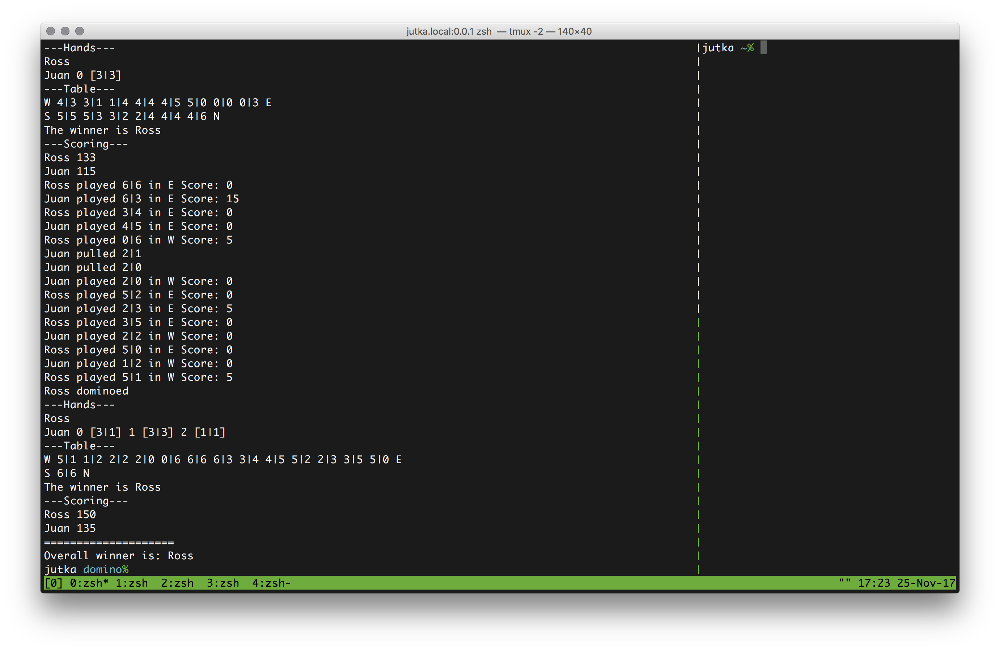

# All-fives domino game engine with computer opponents

This is my implementation of the popular All-fives domino game engine.  
Currently it supports human players and 'AI' players



## Usage

```
Running a whole game until someone reaches the 150 score mark:

$ ruby dominogame.rb
```

## Files

```
dominogame.rb    main program, run this
domino.rb        game logic
```
## Player personalities

```
greedyplayer.rb  greedy player logic always takes the most valuable move
humanplayer.rb   human player with console I/O
randomplayer.rb  dumb ai that plays a random valid move every time
dummyplayer.rb   player ai template
```
